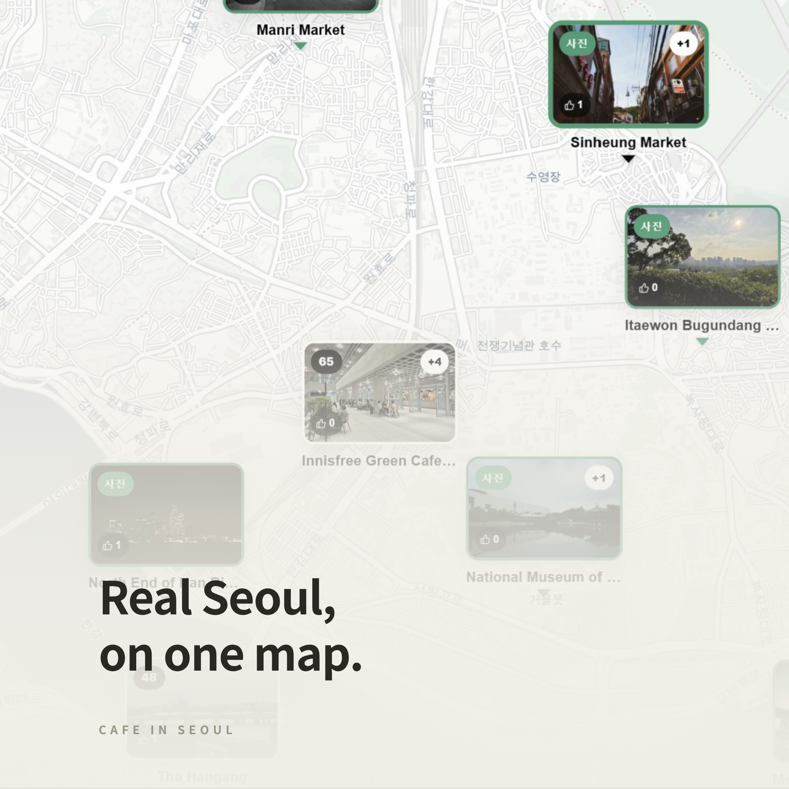
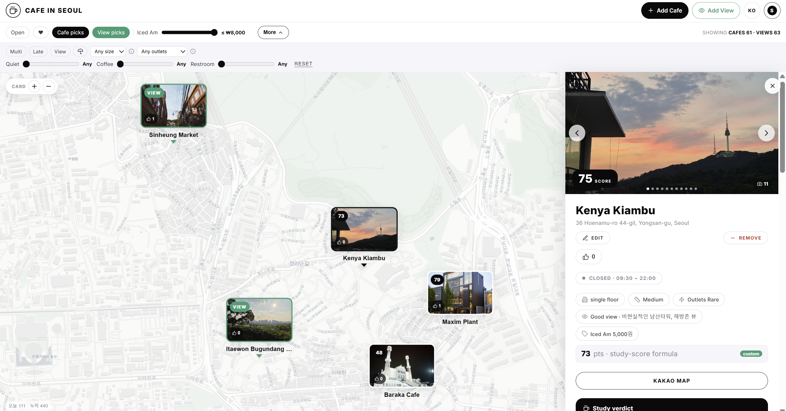

# Cafe in Seoul

**Find Seoul's best cafés to study in — and the prettiest spots to shoot — on one map.**

### 🗺️ Try it live → **[cafe-in-seoul.com](https://cafe-in-seoul.com)**

---

Cafe in Seoul maps two kinds of places worth leaving the house for:

- ☕ **Cafe picks** — cafés that are genuinely good for getting work done (*카공*): cheap Americano, plenty of outlets, quiet rooms, open late, space to spread out.
- 🌇 **View picks** — scenic spots worth a photo: parks, old markets, riversides, rooftops.

Instead of anonymous pins, **every place shows up as its own photo card right on the map** — so you can see where you'd actually be going before you tap. Zoom out and overlapping cards politely collapse into the top-rated one (with a `+N` badge for the rest).

## What you can do

- 📸 **Browse by photo, not pins** — the map is built from real photos of each café and spot, so you can read the vibe at a glance.
- 🏆 **Trust the study score** — every café gets a **0–100 study score** built from the things that actually matter for a work session: Americano price, outlets, number of floors, how late it stays open, how much room it has, and whether it has a view — plus crowd votes on quiet, coffee, and restrooms. Tap the score to see the exact breakdown; nothing is hidden.
- 🎚️ **Tune it to _you_** — sign in and drag the sliders to weight the score by your own priorities (care more about outlets and quiet than price? say so). Your ranking updates instantly and stays private to you.
- 🔎 **Filter to exactly what you want** — open now, open late, multi-floor, has a view, all-weather, minimum size, minimum outlets, a price cap, and minimum ratings for coffee / quiet / restroom.
- 📖 **Read the details** — a swipeable photo carousel, today's hours, price, floors, size, outlets, a written **study verdict**, and a one-tap link to Kakao Map for directions.
- ❤️ **Like & vote** — like the places you love, and rate cafés 1–5 on coffee, quiet, and restrooms so the crowd keeps the scores honest.
- ✍️ **Share your own** — write a story, leave a comment, and add your own photos once you're signed in.
- ➕ **Add a place** — spotted a café or view that belongs here? Anyone signed in can propose one; it goes into a review queue before it shows up for everyone.
- ☔ **Rainy-day mode** — cafés connected directly to a subway station underground are flagged, so you never get soaked on the way.

## Two languages, fully translated

Flip between **한국어 and English** with one tap. It's not just the buttons — place names, addresses, reviews, and comments are translated too, so the whole map reads naturally in either language.

## On your phone

Cafe in Seoul works great in a mobile browser and can be **installed as an app** — a full-screen map, plus a detail sheet you swipe up from the bottom and swipe down to dismiss.

## Getting started

1. Open **[cafe-in-seoul.com](https://cafe-in-seoul.com)**.
2. Pan around the map and tap any photo card to see the details.
3. _(Optional)_ Sign in to like places, vote, add your own cafés and views, and tune the study score to your taste.

That's it — no download required to start exploring.

---

Made for anyone hunting a good seat, a quiet corner, or a great view in Seoul. 
Building it? See <a href="DEVELOPMENT.md">DEVELOPMENT.md</a>.

